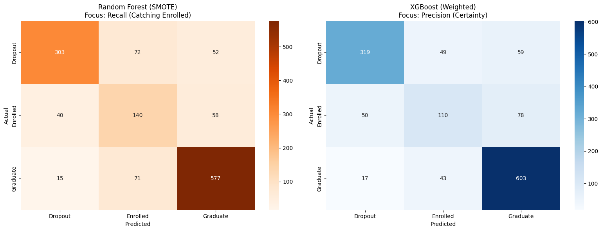
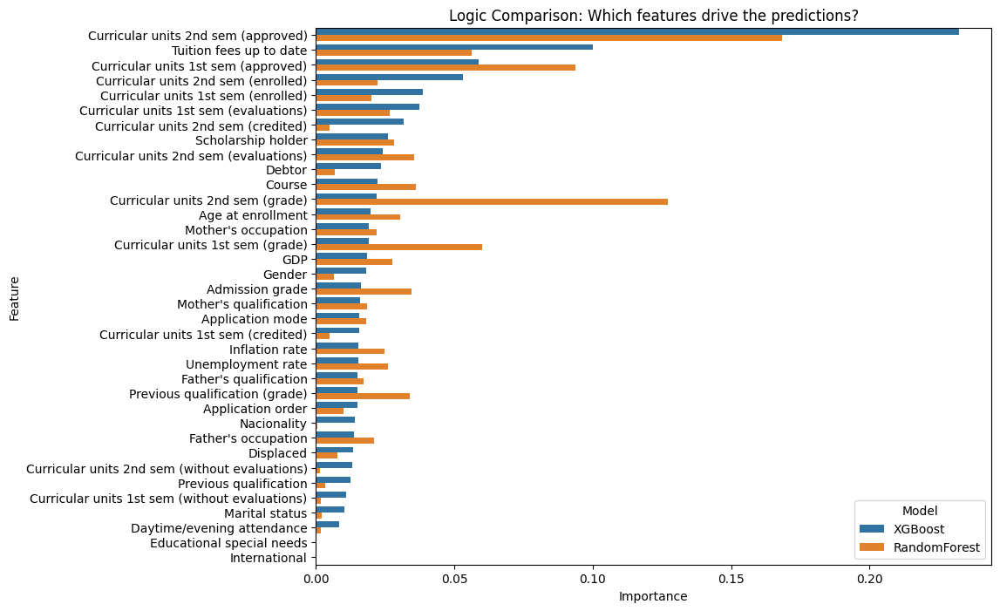
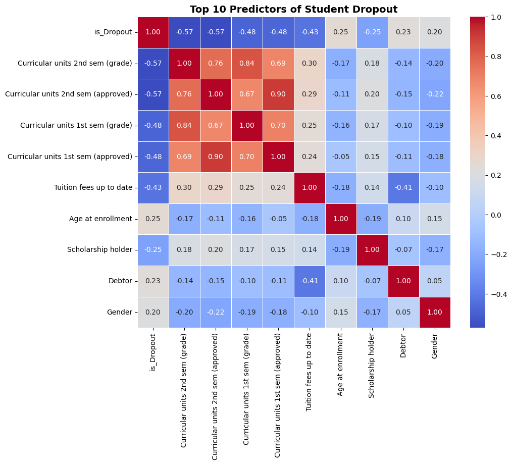

# 🎓 Student Dropout Prediction using Machine Learning

> A complete end-to-end machine learning pipeline to predict student academic outcomes using the UCI Student Dataset, with a focus on handling class imbalance and optimizing multi-class performance.

---

## 📌 Problem Statement

Student dropout is a critical issue in education systems worldwide. Early identification of at-risk students can help institutions take proactive measures.

This project builds a **multi-class classification model** to predict whether a student will:

* Dropout
* Remain Enrolled
* Graduate

---

## 🧠 Approach

The project follows a structured ML workflow:

1. **Data Preprocessing**

   * Cleaned and prepared tabular data
   * Encoded categorical variables
   * Scaled features where necessary

2. **Exploratory Data Analysis (EDA)**

   * Analyzed feature distributions
   * Identified relationships using correlation analysis
   * Investigated patterns linked to student outcomes

3. **Handling Class Imbalance**

   * Applied **SMOTE (Synthetic Minority Oversampling Technique)**
   * Compared results with baseline models
   * Improved minority class prediction performance

4. **Model Development**

   * Trained multiple models:

     * Random Forest
     * XGBoost
   * Used **pipeline-based workflows** for consistency

5. **Hyperparameter Optimization**

   * Performed **RandomizedSearchCV with 5-fold cross-validation**
   * Tuned models for optimal generalization

6. **Evaluation**

   * Used:

     * F1-score (macro & weighted)
     * Confusion Matrix
     * Classification Report
   * Focused on balanced multi-class performance

7. **Model Interpretation**

   * Analyzed **feature importance**
   * Identified key factors influencing student dropout

---

## ⚙️ Tech Stack

* **Language:** Python
* **Libraries:**

  * Pandas, NumPy
  * Scikit-learn
  * XGBoost
  * Imbalanced-learn
  * Matplotlib, Seaborn

---

## 📊 Visual Results

### Confusion Matrix


### Feature Importance


### Top 10 Predictors


---

## 📊 Key Highlights

* Built a **robust multi-class classification system**
* Effectively handled **imbalanced data using SMOTE**
* Applied **cross-validation and hyperparameter tuning**
* Focused on **interpretability through feature importance**
* Designed a **reproducible ML pipeline**

---

## 📈 Results

* Achieved strong performance across all classes
* Improved prediction of minority classes (Enrolled)
* Identified important predictors such as academic history and student demographics

---

## 🔬 Key Insights

- Academic performance indicators strongly influence final outcomes  
- Class imbalance significantly biases model predictions without correction  
- SMOTE improves recall for minority classes (Dropout)  
- Tree-based models capture non-linear relationships effectively

---

## 🚀 Getting Started

### 1. Clone the repository

```bash
git clone https://github.com/AkhundMubeen/Predicting-Student-Dropout-A-Comprehensive-Academic-Success-Study.git
cd Predicting-Student-Dropout-A-Comprehensive-Academic-Success-Study
```

### 2. Install dependencies

```bash
pip install -r requirements.txt
```

### 3. Run the notebook

```bash
jupyter notebook
```

---

## 📂 Dataset

* UCI Student Dataset
* link here: https://archive.ics.uci.edu/dataset/697/predict+students+dropout+and+academic+success

---

## 🔍 Future Scope

* Deployment as a web application
* Integration with real-time student data systems
* Experimentation with deep learning models

---

## 👤 Author

**MUBEEN AKHUND**

* GitHub: https://github.com/AkhundMubeen
* LinkedIn: https://www.linkedin.com/in/mubeen-akhund-b3004335a/

---

## ⭐ Acknowledgements

* UCI Machine Learning Repository
* Open-source ML community
